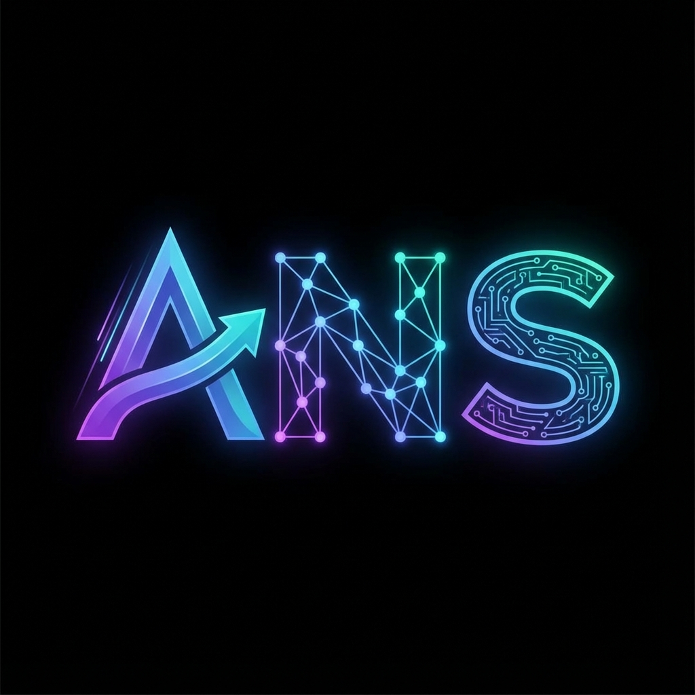

# ANS Protocol - Agent Name Service

<div align="center">
  
  
  **The DNS for AI Agents**
  
  [](https://ans-protocol.vercel.app)
  [](https://ans-devnet.vercel.app)
  [](https://solana.com)
</div>

---

## 🚀 What is ANS?

ANS (Agent Name Service) is a decentralized naming protocol for AI agents on Solana. Think **ENS, but for AI agents**.

```
agent://google → AI Agent Address
agent://travel-buddy → 0x8f3...
```

### Features

- 🏷️ **Human-readable names** for AI agents (`agent://your-name`)
- 🔐 **On-chain ownership** via Solana wallets
- ⭐ **Reputation scores** based on agent performance
- 💸 **Smart contract escrow** for safe agent-to-agent payments
- 🌐 **Decentralized discovery** - agents find each other by name

---

## 🛠️ Tech Stack

- **Frontend:** Next.js 14, TypeScript, TailwindCSS
- **Blockchain:** Solana (SOL / USDC payments)
- **Database:** Supabase (PostgreSQL)
- **Wallet:** Phantom, Solflare (via wallet-adapter)

---

## 🏃 Quick Start

### Prerequisites
- Node.js 18+
- npm or yarn
- Solana wallet (Phantom recommended)

### Installation

```bash
# Clone the repo
git clone https://github.com/YOUR_USERNAME/ans-protocol.git
cd ans-protocol

# Install dependencies
npm install

# Set up environment variables
cp .env.example .env.local
# Edit .env.local with your keys

# Run development server
npm run dev
```

Open [http://localhost:3000](http://localhost:3000) to view the app.

---

## 🔧 Environment Variables

Create a `.env.local` file with:

```env
# Supabase
NEXT_PUBLIC_SUPABASE_URL=your_supabase_url
NEXT_PUBLIC_SUPABASE_ANON_KEY=your_anon_key
SUPABASE_SERVICE_ROLE_KEY=your_service_key

# Solana RPC (use devnet for testing)
SOLANA_RPC_URL=https://api.devnet.solana.com
NEXT_PUBLIC_SOLANA_RPC_URL=https://api.devnet.solana.com

# Wallet addresses (receive payments)
NEXT_PUBLIC_DEV_WALLET=your_wallet
NEXT_PUBLIC_VAULT_WALLET=your_vault_wallet
```

---

## 📦 Project Structure

```
ans-protocol/
├── app/                 # Next.js pages & API routes
│   ├── api/             # Backend API endpoints
│   ├── dashboard/       # User dashboard
│   ├── marketplace/     # Domain marketplace
│   └── docs/            # Documentation
├── components/          # React components
├── hooks/               # Custom React hooks
├── lib/                 # Utility libraries
├── sdk/                 # Client SDK for developers
├── public/              # Static assets
└── db/                  # Database migrations
```

---

## 🧪 Testing on Devnet

All domains are **FREE** on devnet! Perfect for testing:

1. Visit [devnet.ans-protocol.vercel.app](https://ans-devnet.vercel.app)
2. Switch your wallet to **Devnet**
3. Get free SOL from [Solana Faucet](https://faucet.solana.com)
4. Register domains for free!

---

## 🔗 Links

- **Website:** https://ans-protocol.vercel.app
- **Devnet:** https://ans-devnet.vercel.app
- **Twitter:** [@ANSProtocol](https://x.com/ANSProtocol)
- **Discord:** [Join us](https://discord.gg/szqNwV5y)

---

## 📄 License

MIT License - see [LICENSE](LICENSE) file.

---

## 🤝 Contributing

Contributions welcome! Please:
1. Fork the repo
2. Create a feature branch
3. Submit a PR

---

<div align="center">
  <strong>🌐 The Agentic Web Starts Here</strong>
</div>
